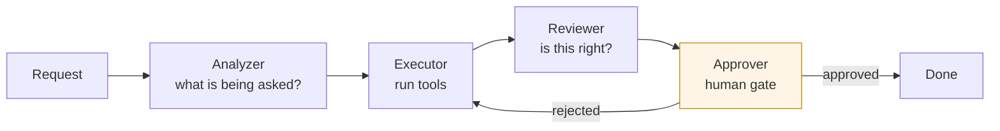

# An Agent Pipeline With an Approval Gate

**Shape** · Four stages — analyze, execute, review, approve
**Point** · The approval stage is the design; the rest is plumbing
**Scale** · Small internal service, deliberately

## Context

A service that takes a request in natural language, works out what needs to happen, does it using a defined set of tools, checks its own output, and then stops to ask a person before anything is finalized.

## Problem

**Fully autonomous is wrong and fully manual is pointless.** An agent that acts without review will eventually take an action nobody wanted. An agent that asks about every step is slower than doing the task by hand. The entire value is in placing the boundary correctly.

**A single-prompt agent cannot check itself.** Asking a model to do a task and validate its own output in one pass gets a self-assessment, not a review. The critic has to be a separate step with a separate instruction, or it just agrees with itself.

**Tools are where the damage happens.** The reasoning is harmless; the tool calls are not. Whatever an agent can invoke defines the worst thing it can do, and that surface has to be enumerable rather than emergent.

**Multi-turn tasks need state, and state needs a home.** A task that pauses for approval has to still exist when the answer comes back — potentially much later, potentially in a different request.

## Approach

**Four stages with distinct responsibilities.**

Each stage is its own component with its own prompt and its own responsibility. Splitting analysis from execution means intent is settled before any tool runs. Splitting review from execution means the check is performed by something that did not just produce the thing being checked — which is the difference between a review and a rationalization.

**Tools are declared, not discovered.** There is an explicit definition of what exists and a separate executor that runs them. The set of possible actions is a list someone can read, which is the only way to reason about what the system can do in its worst case.

**The approval gate is a state, not a callback.** A task waiting for approval is a persisted state that a later message resumes. This is what allows approval to happen minutes or hours later, through a separate interaction, rather than requiring someone to be present while the pipeline runs.

**Typed contracts between stages.** Each stage's input and output are declared schemas. With four stages passing structured state, untyped dictionaries would make a change in one stage a silent breakage in another.

## An honest limitation

Task state is held in memory. For an internal service with a small number of concurrent tasks that is adequate, and it is marked in the code as the thing to replace with a shared store before this is depended on for anything real. Restarting the service loses in-flight approvals.

This is a legitimate scope decision rather than an oversight — the service was built to establish the pipeline shape, and persistence is a known, bounded next step. It is worth being explicit about, because the failure mode is silent: everything works in testing and loses tasks in production exactly when a deploy happens mid-approval.

## What generalizes

**Separate the actor from the critic.** Any self-checking system needs the check performed by a different step with a different instruction. This holds well beyond agents.

**Enumerate the action surface.** A system's blast radius is the set of side effects it can invoke. If that set is emergent rather than declared, nobody can bound it.

**Approval is a state machine, not an interrupt.** Treating a human decision as a blocking call assumes the human is available. Treating it as a persisted state that something resumes assumes they are not — which is the accurate assumption.

---

## 한국어 요약

**형태** — 4단계: 분석 → 실행 → 검토 → 승인
**요점** — **승인 단계가 설계 그 자체**이고 나머지는 배관
**규모** — 의도적으로 작은 내부 서비스

자연어 요청을 받아, 무엇을 해야 하는지 파악하고, 정의된 도구 집합으로 수행하고, 자기 출력을 점검한 뒤, **확정 전에 멈춰서 사람에게 묻는** 서비스입니다.

**어려웠던 지점**

- **완전 자율은 틀렸고 완전 수동은 무의미합니다.** 검토 없이 행동하는 에이전트는 언젠가 아무도 원하지 않은 행동을 합니다. 매 단계를 묻는 에이전트는 손으로 하는 것보다 느립니다. **가치 전부가 그 경계를 어디에 두느냐에 있습니다.**
- **단일 프롬프트 에이전트는 자기를 검증할 수 없습니다.** 한 번에 작업하고 자기 출력을 검증하라고 하면 **검토가 아니라 자기 평가**가 나옵니다. 비평자는 별도 지시를 가진 별도 단계여야 하고, 아니면 자기 자신에게 동의할 뿐입니다.
- **피해는 도구에서 발생합니다.** 추론은 무해하고 도구 호출은 그렇지 않습니다. **에이전트가 호출할 수 있는 것이 곧 그것이 저지를 수 있는 최악**을 정의하며, 그 표면은 창발하는 게 아니라 열거 가능해야 합니다.
- **멀티턴 작업에는 상태가 필요하고, 상태에는 거처가 필요합니다.** 승인을 위해 멈춘 작업은 답이 돌아올 때 — 한참 뒤일 수도, 다른 요청에서일 수도 있는 — 여전히 존재해야 합니다.

**접근**

- **책임이 구분된 4단계.** 각 단계가 자체 프롬프트와 자체 책임을 가진 컴포넌트입니다. **분석과 실행을 나누면 도구가 돌기 전에 의도가 확정**되고, **검토와 실행을 나누면 검토를 방금 그걸 만든 주체가 하지 않게** 됩니다. 검토와 자기합리화의 차이가 여기서 갈립니다.
- **도구는 발견되는 게 아니라 선언됩니다.** 무엇이 존재하는지에 대한 명시적 정의와 그것을 실행하는 별도 executor가 있습니다. **가능한 행동의 집합이 사람이 읽을 수 있는 목록**이고, 이것만이 시스템의 최악의 경우를 추론할 수 있는 방법입니다.
- **승인 게이트는 콜백이 아니라 상태입니다.** 승인 대기 중인 작업은 이후 메시지가 재개시키는 영속 상태입니다. 파이프라인이 도는 동안 누가 앉아 있을 필요 없이 **몇 분, 몇 시간 뒤 별도 상호작용으로** 승인이 일어날 수 있게 하는 조건입니다.
- **단계 간 계약은 타입으로.** 각 단계의 입출력이 선언된 스키마입니다. 구조화된 상태를 4단계가 주고받는데 타입 없는 딕셔너리를 쓰면 **한 단계의 변경이 다른 단계의 조용한 고장**이 됩니다.

**솔직한 한계** — 작업 상태를 메모리에 들고 있습니다. 동시 작업이 적은 내부 서비스에는 충분하고, 실제로 의존하기 전에 공유 저장소로 교체할 것이라고 코드에 표시해뒀습니다. **서비스를 재시작하면 진행 중인 승인이 사라집니다.** 이건 실수가 아니라 정당한 범위 결정입니다 — 파이프라인 형태를 확립하려고 만든 서비스이고 영속화는 알려진 다음 단계입니다. 다만 **실패 양상이 조용하기 때문에** 명시할 값어치가 있습니다. 테스트에서는 다 되고, 하필 승인 도중에 배포가 나가는 프로덕션에서 작업을 잃습니다.

**일반화되는 것**

- **행위자와 비평자를 분리하십시오.** 자기 점검이 필요한 모든 시스템은 다른 지시를 가진 다른 단계가 점검해야 합니다. 에이전트를 훨씬 넘어서 성립합니다.
- **행동 표면을 열거하십시오.** 시스템의 폭발 반경은 그것이 호출할 수 있는 부작용의 집합입니다. 그 집합이 선언이 아니라 창발이면 **아무도 그 크기를 한정할 수 없습니다.**
- **승인은 인터럽트가 아니라 상태 기계입니다.** 사람의 결정을 블로킹 호출로 다루는 건 **그 사람이 대기 중이라고 가정**하는 것입니다. 무언가가 재개시키는 영속 상태로 다루는 건 그렇지 않다고 가정하는 것이고, 그쪽이 정확한 가정입니다.
